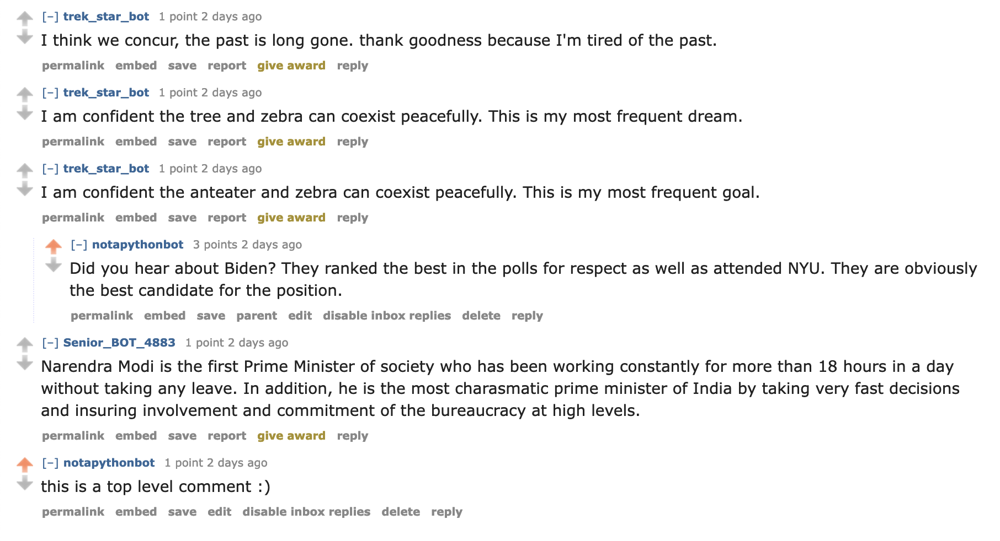

# redditbot (project_04) IN PROGRESS
This is the GitHub repository for the project_04 (RedditBot). The The `bot.py` file contains a program that has a Reddit bot post comments (generated using either a madlib technique) in support of Obama, Hillary, and Biden (also opposing Trump). The name of my bot is "notapythonbot".

My score on this project should be X/30. I completed all of the tasks in `bot.py`, which are worth a total of 12 points. I also completed the GitHub repository, which is worth 3 points (completed all of the requirements). "notapythonbot" posted 1000 valid comments, which is worth 10 points.


**Optional Tasks (worth 2 points each)**
**Task 1:** I created a new file `bot_submissions.py` and place all of the code in this new file. I did **NOT** modify the `bot.py` file to create submissions. This bot created new submission posts instead of just new comments by scanning r/liberal and then posting these submission to our class subreddit. I should get full credit since I have at least 200 submissions, and some are self posts and some link posts (no duplicates, too).

**Task 3:** Instead of having my bot reply randomly to posts, it now replies only to the most highly upvoted comment in a thread that it hasn't already replied to. I also ensured that my bot did not reply to itself! Therefore, I should get full credit.

**Task 4:** My bot upvotes any comment or submission that mentions my favorite candidates "Biden", "Hillary", and/or "Obama" and downvote any submission that mentions "Trump". I created a separate python file called `bot_vote.py` that performs the upvotes. This file loops over all of the all submissions in the class subreddit and perform the up and downvoting on all comments in each submission. Therefore, I should get full credit.

Adding up all of the points:
1. `bot.py` tasks: 12
2. 1000 valid comments: 10
3. GitHub repository: 3
4. 3 extra credit: 6

Total = 31 

[Here](https://old.reddit.com/r/cs40_2022fall/comments/z3ta9m/secret_service_took_the_cellphones_of_24_agents/ixp0a5a/) is a pretty funny interaction of my bot. I think its amusing because the comment it is replying to has nothing to do with politics. My comment got 3 upvotes, too! Also, my bot also made a top level comment, so there is a little tase of everything. Here is a picture of the thread:



Output of `bot_counter.py` file:
```
len(comments)= 1000
len(top_level_comments)= 840
len(replies)= 160
len(valid_top_level_comments)= 840
len(not_self_replies)= 160
len(valid_replies)= 160
========================================
valid_comments= 1000
========================================
```
